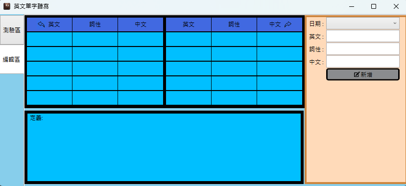

# English Vocabulary Dictation Test

**This project has completed but this markdown file is still being edited and not all content has been completed yet.**

# 1. Introduction

This project was developed as a side project while I was preparing for the IELTS exam, to help myself review for the test. It was also used as teaching material for a student from a certain university (the student developed an English interface under my guidance, while mine is in Chinese).

I will briefly introduce the functionality and usage of this software. Everyone is welcome to download and test it from GitHub. If there are any questions, feel free to email me.

# 2. software description

## 2.1. Save words

(Flowchart)

(Explaination)

## 2.2. Test words

(Flowchart)

(Explaination)

## 2.3. Other functionaliy

(Explaination)
